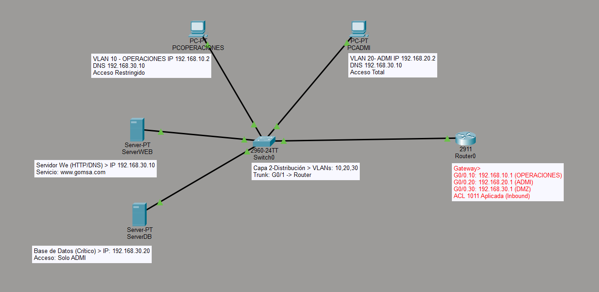
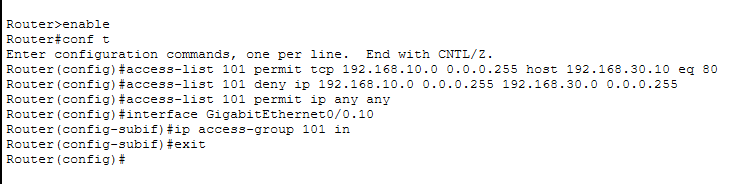
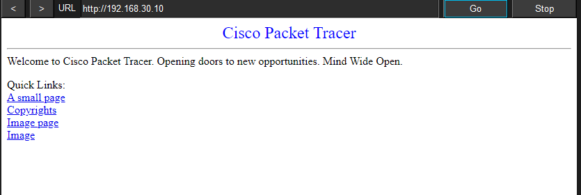
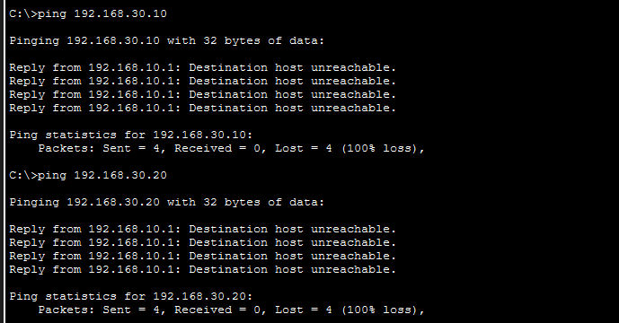
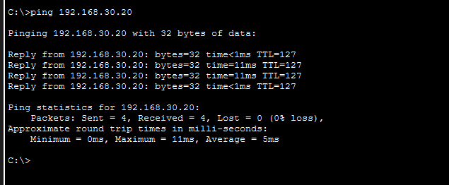

# Seguridad Perimetral y Control de Acceso (ACLs)

## 1. El Desafio de Seguridad

En este escenaruo avanzado la sucursal de la Empresa requiere proteger su Centro de Datos. Se implementan dos servicio críticos: un Servidor Web de consulta pública y un Servidor de Base de Datos con información sensible de Aduanas.

### Obejtivo: 

Garantizar que el personal de Operaciones pueda consultar el portal web, pero tenga estrictamente prohibido el acceso a la Base de Datos, mientras que Administración mantiene el acceso total para auditoria.

## 2. Arquitectura de la DMZ 

Creación de un nuevo segmento lógico para los recursos compartidos 

| Recurso | VLAN | IP Estática | Servicio |
| :--- | :---: | :--- | :--- |
| **Servidor Web** | 30 | 192.168.30.10 | HTTP (Puerto 80) |
| **Base de Datos** | 30 | 192.168.30.20 | SQL/Privado | 

## 3. Implementación de ACL Extendida (Capa 4)

A diferencia de las listas estándar, se utilizó una **ACL Extendida (101)** para filtrar tráfico basado en protocolos y puertos específicos, optimizando la seguridad en el Router.

## 4. Evidencia de Pruebas (Compliance)

* **Prueba Exitosa (HTTP):** PCOPERACIONES accede correctamente a `http://192.168.30.10`, esto valida la conectividad directa hacia el servidor web mediante su dirección IPv4, lo que confirma el correcto funcionamiento de la ACL en la capa de red.

*  **Prueba de Bloqueo (ICMP/IP):** El comando `ping` desde PCOPERACIONES hacia SERVERDB es rechazado por el Router (`Destination host unreacheble`)

*  **Acceso Total:** Se verificó que PCADMI mantiene conectividad completa hacia ambos servidores, cumpliendo con los privilegios de jerarquía.

## Habilidades
* Listas de Acceso Estendidas (ACL)
* Gestión de servidores
* Protocolo TCP/UDP
* Seguridad de red

## Recursos

